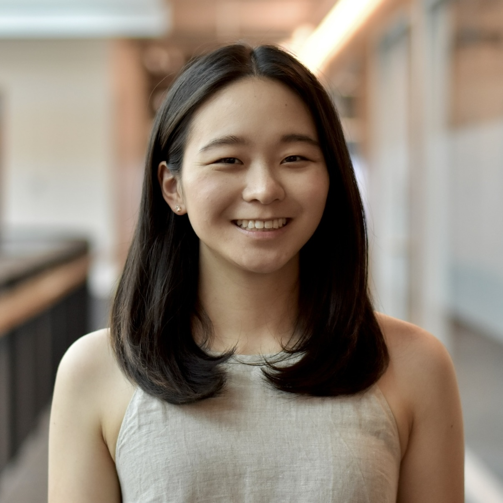

---
# Feel free to add content and custom Front Matter to this file.
# To modify the layout, see https://jekyllrb.com/docs/themes/#overriding-theme-defaults

layout: home
---

## Hello! 

<!-- {: style="width: 25%; height: 25%; float: right} -->

I'm a recent graduate of the University of Washington (UW), where I received my masters degree in computer science and engineering. Previously, I received my bachelors degree in computer science and applied mathematics with College Honors, also at UW.

I'm broadly interested in applied machine learning, reasoning in AI, and engineering. I'm currently a machine learning engineer at [TrueMedia.org](https://www.truemedia.org) where I'm tackling deepfake detection as a continuation of [research]({{ site.baseurl }}) I conducted at UW. Starting this fall, I'll be a software engineer at Microsoft working on datacenter operations. Away from my computer, I enjoy running, reading, cooking, and dabbling in the various art forms.

___
 
In the recent past, I:
- led the release of an updated [survey paper](https://arxiv.org/abs/2407.06174v2) on deepfake video generation and detection with my collaborators at TrueMedia, accepted to the [DMLR workshop](https://dmlr.ai) at ICML 2024
- was a TA for CSE 599N (Machine Learning for Neuroscience)
- was a TA for CSE 446/546 (Machine Learning) at UW for 5 quarters, serving as head TA for 4 quarters
- received an Honorable Mention for the [Bob Bandes Memorial Award](https://www.cs.washington.edu/students/ta/bandes) for Excellence in Teaching
- received the [Boeing Excellence Award](https://amath.washington.edu/news/2023/06/15/2023-department-award-winners) from the UW Department of Applied Mathematics 

___
 
This site (attempts to) organize my notes, updates, and miscellaneous digital artifacts. It is very much a work in progress!