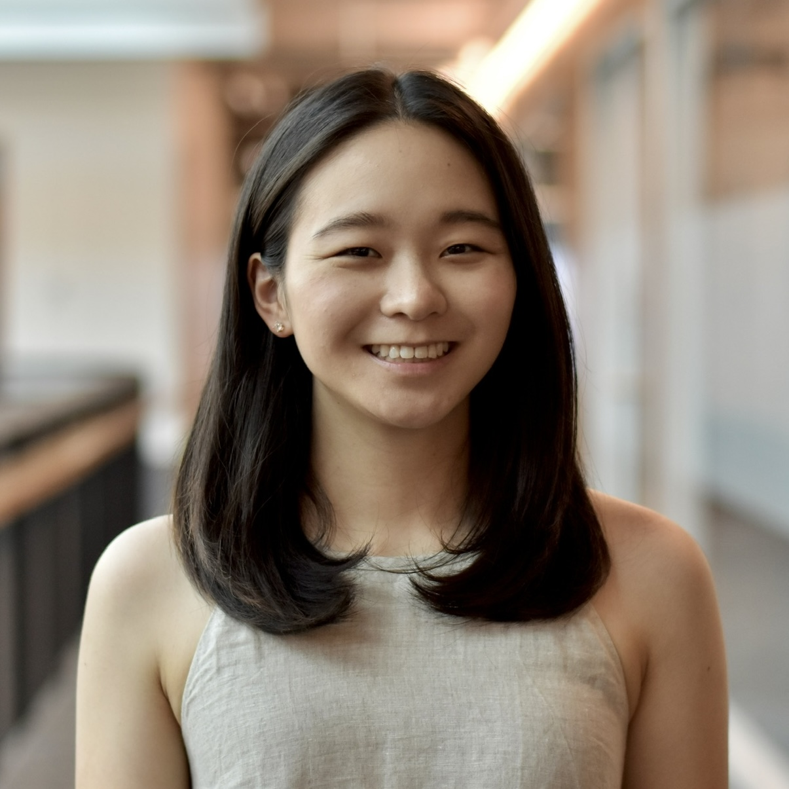

---
# Feel free to add content and custom Front Matter to this file.
# To modify the layout, see https://jekyllrb.com/docs/themes/#overriding-theme-defaults

layout: home
---

## Hello! 

I'm a software engineer at Microsoft currently working on services supporting datacenter operations. I'm a recent graduate of the University of Washington, where I received my masters degree in computer science. I also completed my bachelors degree in computer science and applied mathematics with College Honors at UW. 

I'm broadly interested in investigating how people interact with machine learning systems, how those systems impact people, and how we can mitigate harms. These interests stem from prior work; before joining Microsoft, I was a machine learning engineer at [TrueMedia.org](https://www.truemedia.org) where I tackled deepfake detection as a continuation of [research]({{ site.baseurl }}) I conducted at UW for my masters degree. Before that, I researched [computer vision techniques for mobile health applications]({{ site.baseurl }}). 

Other long term interests of mine include [running](https://hannahyklee.github.io/running/2025/03/10/years-in-running.html), hiking, reading, and creating art ([often]({{ site.baseurl }}) of places I've run in or hiked around!).

This site attempts to organize my notes, updates, and miscellaneous digital artifacts. It is very much a work in progress!

___
 